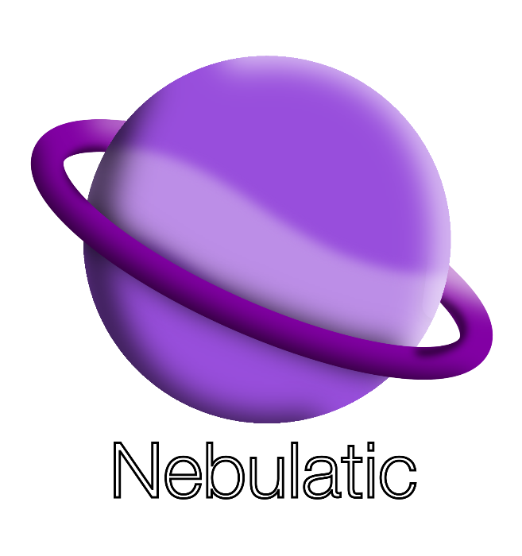

___
 

> [!IMPORTANT]
> This OS will have a strong focus for developers, and some tools they may use.

> [!NOTE]
> Believe it or not, this OS is not actually ready yet. When it is ready, this page will be changed.

> [!TIP]
> We recommend that you either run Nebulatic OS on a virtual machine like [VirtualBox](https://www.virtualbox.org/), or make a bootable USB drive that has Nebulatic OS on it using something like [Rufus](https://rufus.ie/) or [Etcher](https://etcher.balena.io/) if you do not have plans to use this operating system on your main drive.

Holds the files for Nebulatic.

The <a href="https://github.com/andromedaofficial/Nebulatic-OS/raw/main/Window%20Drag%20Test%20%7C%20Working%20Elements%203.sb3">Window Drag Test</a> is a Scratch .sb3 file. Here is some of the information not listed in it.

 
This is going an early visual demo for Nebulatic. You can drag the window, close the window, maximize and minimize the window, reopen the window, and etc. This can only open 1 window at a time currently.
Updates for the operating system on one of the 3 following GitHub accounts:
 
<a href="https://github.com/gitventurer">@gitventurer</a>
 
<a href="https://github.com/xrg2014">@XRG2014</a>
 
<a href="https://github.com/andromedaofficial">@AndromedaOfficial</a>
 
 
The ISO will be released on the Internet Archive and on the GitHub account of <a href="https://github.com/andromedaofficial">@AndromedaOfficial</a>. Announcements of the OS launching will be documented at launch.

By the Andromeda Team.

 
Current Developers:
 
<a href="https://github.com/gitventurer">@gitventurer</a>
 
<a href="https://github.com/xrg2014">@XRG2014</a>
 
 
Release Pages and Andromeda Repos:
 
<a href="https://github.com/andromedaofficial">@AndromedaOfficial</a>

